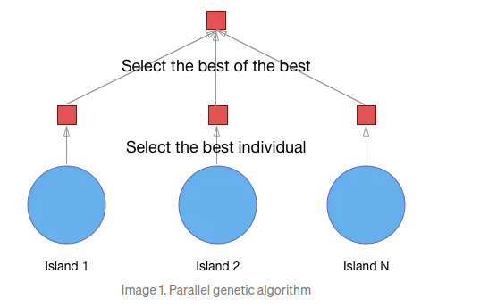
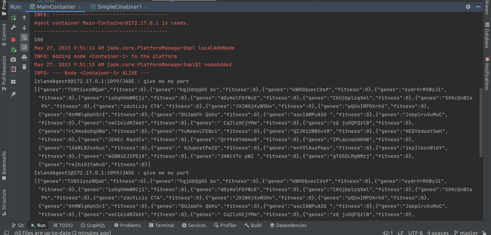
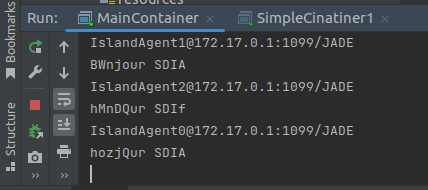
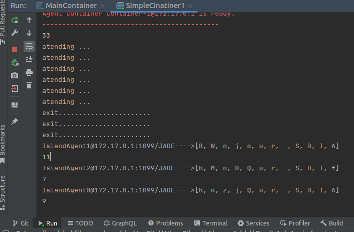

# Parallel and distributed genetic algorithms
## 
The implementation of genetic algorithms using the "island model" 
approach involves creating multiple subpopulations that evolve independently 
and occasionally exchange individuals to explore different solutions efficiently.



## Test

#Image :

```markdown  


```


```markdown  


```


```markdown  

```
